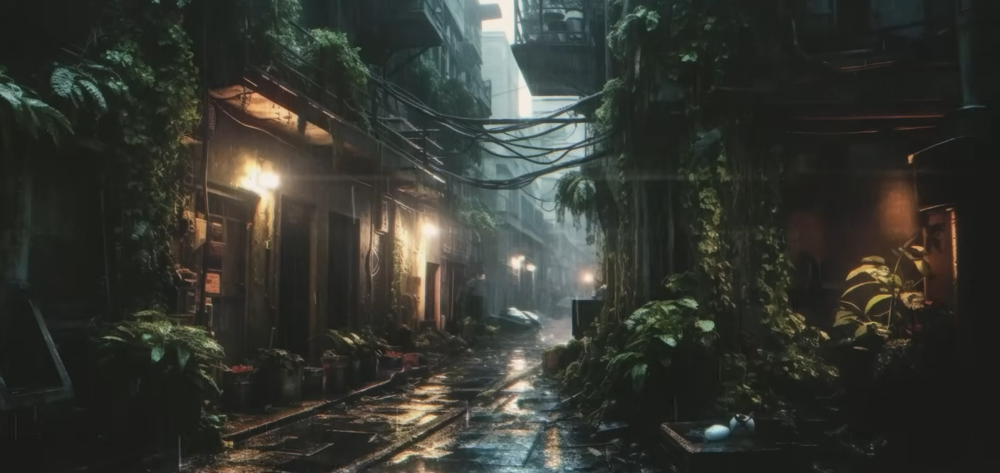
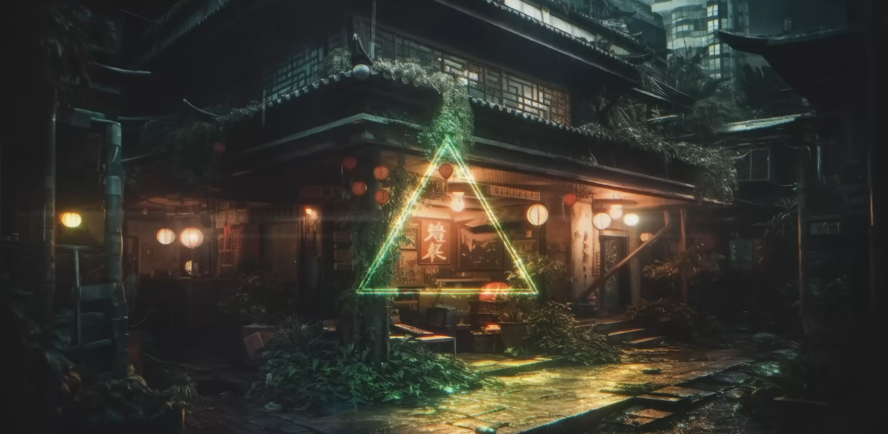
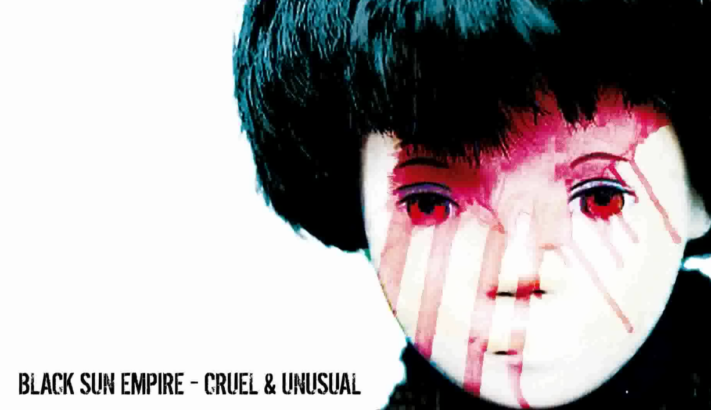
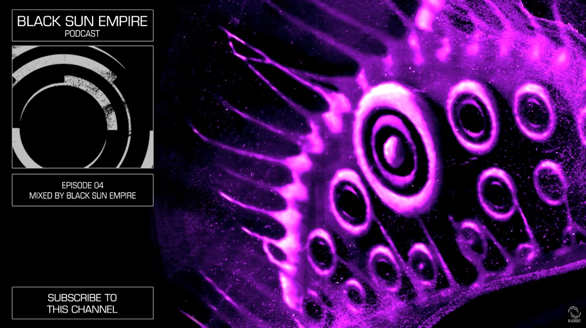
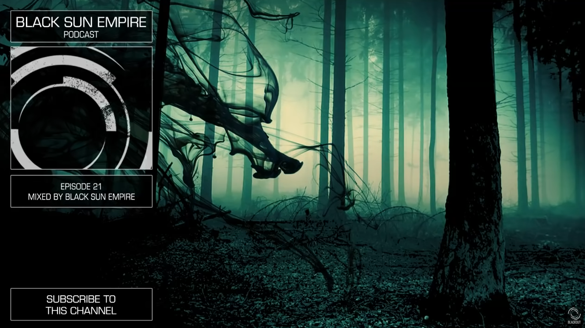

&nbsp;

# Sync_scanner
Программа, помогающая считывать буквенные данные с фотографий
   

# Навигация
 - [Установка проекта на ПК](#download_project)
 - [Настройка готового проекта](#setting_up_a_project)
 - [Инструкция по установке Cuda](#cuda)
 - [Полезные команды](#useful_commands)
 - [Основные технологии / фрейморки](#basic_technologies)
 - [Полезная информация](#useful_information)
 - [Основные зависимости](#main_dependencies)
 - [Музычка для разработки](#nekos_music)
   

 
## Установка проекта на ПК
1. Откройте консоль, вбив в поисковике ПК: <code>cmd</code>
2. Перейдите в директорию, куда хотите установить проект, пропишите следующую команду в консоль: <code>cd N:\Путь\до\папки\с\проектами</code>
3. Введите следующую команду: git clone https://github.com/[ник]/Sync_scanner.git
4. Откройте скачанный проект и можете приступать к разработке
   

 
## Настройка готового проекта
• Версия Python: 3.11

• После скачивания проекта к себе на компьютер не забудьте установить необходимые зависимости, прописав к консоли команду: 
<code>pip install -r requirements.txt</code>
   

 
## Инструкция по установке Cuda
1. Откройте PowerShell от имени администратора
2. Проверьте, что оказались в папке system32
3. Введите команду `wsl --install`
4. Подождите (долгую) установку ubuntu в windows 10-11
5. Зарегистрируйте Unix пользователя
6. Создайте venv через Ubuntu: https://www.jetbrains.com/help/pycharm/using-wsl-as-a-remote-interpreter.html#wsl-terminal
7. Активируйте виртуальное окружение: `source venv/bin/activate`
8. Зарегистрируйтесь разработчиком Nvidia: https://developer.nvidia.com/developer-program

9. Скачайте и установите новый драйвер под свою видеокарту (проверить её характеристики можете следующим образом: диспетчер задач -> производительность -> Графический процессор Nvidia) с сайта Nvidia: https://www.nvidia.com/drivers

10. Скачайте и установите `cuda toolkit 11.8` для Вашей ОС Windows (там будет примерно 3 гига): https://developer.nvidia.com/cuda-11-8-0-download-archive

11. Запустите check_video_cards_visibility.py, чтобы проверить видимость видеокарт, если не появляется сообщение `"Не вижу видеокарт!"`, шаг 12. можно пропустить
12. Скачайте и установите `cudnn 9.0`: https://developer.nvidia.com/cudnn-downloads
13. Обновите `pip`: `pip install --upgrade pip`
14. Установите `tensorflow` с `Cuda`: `pip install tensorflow[and-cuda]`
15. Установите Keras: `pip install --upgrade keras==3.0.0`
   

 
## Полезные команды
 - Сохранить список зависимостей в файл requirements.txt: `pip freeze > requirements.txt`
 - Сохранить список зависимостей в файл cuda_requirements.txt: `pip freeze > cuda_requirements.txt`
 - Не забывайте активировать venv при работе через консоль Ubuntu: `source venv/bin/activate`
 - Отобразить зависимости в консоль: `pip list`
 - Если вы случайно добавили некоторые файлы в контроль версий, которые не нужно было, можете воспользоваться следующей командой: `git rm --cache [путь до файла]`
 - Удалить все зависимости: `pip uninstall -y -r requirements.txt`
   

 
## Основные технологии / фрейморки
`OpenCV` / `Keras`, `Pillow`, `BytelIO`
   

 
## Полезная информация
 - [Библиотеки для глубокого обучения: Keras](https://habr.com/ru/companies/ods/articles/325432/)  
 - [Документация Keras](https://keras.io/)   (актуальный способ с использованием данной библиотеки)
 - [Декораторы Python: пошаговое руководство](https://habr.com/ru/companies/otus/articles/727590/) (лёгкий способ, изучение подходов)  
 - [Распознавание текста с изображения на Python | EasyOCR vs Tesseract | Компьютерное зрение](https://www.youtube.com/watch?v=H_nXZSM4WiU)  
 - [Документация OpenCV](https://pypi.org/project/opencv-python/)  
 - [Python + OpenCV + Keras: делаем распознавалку текста за полчаса](https://habr.com/ru/articles/466565/)  
 - [Документация Pillow](https://pypi.org/project/pillow/)  
   

 
## Основные зависимости
1. Если работаете через Local terminal (Windows PowerShell) без Cuda:
`pip install tensorflow==2.15.0, keras==2.15.0, pillow==10.2.0`

2. Если работаете через Ubuntu terminal и установили Cuda:
`pip install tensorflow==2.15.0.post1, keras==3.0.0, pillow==10.2.0`
   

 
## Музычка для разработки [Neko's edition]
• Just chill  
|__ [SpaceWave: Ambient Cyberpunk Music](https://www.youtube.com/watch?v=FULCBFlX3Eo)  

  |   
|__ [SpaceWave: Zenctuary](https://www.youtube.com/watch?v=h4k1wIkmf7Q)  

  |   
|__ [SpaceWave: Vaporway](https://www.youtube.com/watch?v=70Wcz-k_PxY)  

• Dark bass for hardcore coding >:D  
|__ [Black Sun Empire: Future Frame](https://www.youtube.com/watch?v=FZyqhW0uEmI&list=RD8zLJS8bvLEE&index=21) ♡   

  |   
|__ [Black Sun Empire: Podcast 04 HQ](https://www.youtube.com/watch?v=TwHS3c6zbwI) [0:00 - 8:15]  

  |   
|__ [Black Sun Empire: Podcast 21 HQ](https://www.youtube.com/watch?v=hgOzpEO47ZI&t=706s)  

   
