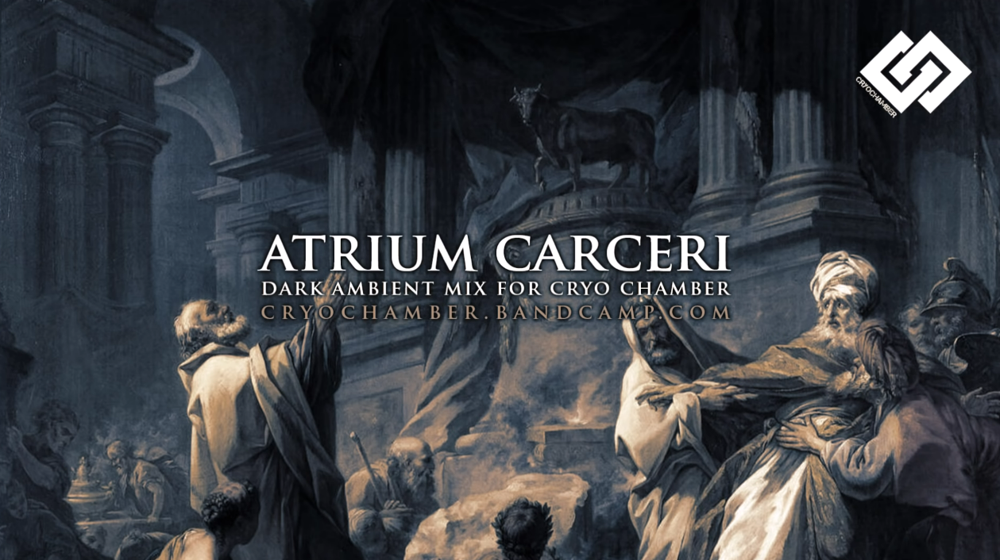

&nbsp;

## *FACE ID*
Библиотека с функциями определения схожести лиц
   

# Навигация
 - [Установка проекта на ПК](#download_project)
 - [Настройка готового проекта](#setting_up_a_project)
 - [Инструкция по установке Cuda](#cuda)
 - [Полезные команды](#useful_commands)
 - [Основные технологии / фрейморки](#basic_technologies)
 - [Полезная информация](#useful_information)
 - [Основные зависимости](#main_dependencies)
 - [Исправление возможных ошибок](#errors_solving)
 - [Музычка для разработки](#nekos_music)
   

 
## Установка проекта на ПК
1. Откройте консоль, вбив в поисковике ПК: `cmd`
2. Перейдите в директорию, куда хотите установить проект, пропишите следующую команду в консоль: `cd N:\Путь\до\папки\с\проектами`
3. Введите следующую команду: git clone https://github.com/GeekNekoS/Face_ID.git
4. Откройте скачанный проект и можете приступать к разработке
   

 
## Настройка готового проекта
 - Версия Python: 3.11
 - После скачивания проекта к себе на компьютер не забудьте установить необходимые зависимости, прописав к консоли команду:  `pip install -r requirements.txt`
   

 
## Инструкция по установке Cuda
1. Откройте PowerShell от имени администратора
2. Проверьте, что оказались в папке system32
3. Введите команду `wsl --install`
4. Подождите (долгую) установку ubuntu в windows 10-11
5. Зарегистрируйте Unix пользователя
6. Создайте venv через Ubuntu: https://www.jetbrains.com/help/pycharm/using-wsl-as-a-remote-interpreter.html#wsl-terminal

7. Активируйте виртуальное окружение: `source venv/bin/activate`
8. Зарегистрируйтесь разработчиком Nvidia: https://developer.nvidia.com/developer-program

9. Скачайте и установите новый драйвер под свою видеокарту (проверить её характеристики можете следующим образом: диспетчер задач -> производительность -> Графический процессор Nvidia) с сайта Nvidia: https://www.nvidia.com/drivers

10. Скачайте и установите `cuda toolkit 11.8` для Вашей ОС Windows (там будет примерно 3 гига): https://developer.nvidia.com/cuda-11-8-0-download-archive

11. Запустите check_video_cards_visibility.py, чтобы проверить видимость видеокарт, если не появляется сообщение `"Не вижу видеокарт!"`, шаг 12. можно пропустить
12. Скачайте и установите `cudnn 9.0`: https://developer.nvidia.com/cudnn-downloads
13. Обновите `pip`: `pip install --upgrade pip`
14. Установите `tensorflow` с `Cuda`: `pip install tensorflow[and-cuda]`
15. Установите Keras: `pip install --upgrade keras==3.0.0`
16. Обновление Keras-cv, чтобы виделись зависимости:`pip install --upgrade keras-cv tensorflow`
17. Обновление Keras: `pip install --upgrade keras`
18. Чтобы устанавливать последние изменения для KerasCV и Keras, вы можете воспользоваться пакетом nightly: `pip install --upgrade keras-cv-nightly tf-nightly`
19. `pip install tensorrt`
   

 
## Полезные команды
 - Активация виртуального окружения (Ubuntu): `source venv/bin/activate`
 - Сохранить список зависимостей в файл requirements.txt: `pip freeze > requirements.txt`
 - Отобразить зависимости в консоль: `pip list`
 - Удалить файл из контроля версий: `git rm --cache [путь до файла]`
 - Удалить все зависимости: `pip uninstall -y -r requirements.txt`
 - Установить зависимости: `pip install -r requirements.txt`
   

 
## Основные технологии / фрейморки
- `TensorFlow` (`Keras`) - библиотека для глубокого обучения, которая предоставляет инструменты для создания и обучения моделей нейронных сетей
- `OpenCV` - библиотека для обработки изображений, которая предоставляет широкий функционал для обработки изображений, включая детекцию лиц, изменение размеров и выравнивание
- `Dlib` - библиотека для извлечения признаков, которая предоставляет мощные инструменты для детекции лиц и извлечения признаков
- `Scikit-learn` - библиотека для сравнения и оценки сходства, содержит алгоритмы для сравнения и оценки точности моделей
- `Pillow` - библиотека для обработки файлов изображений в разных форматах, включая JPEG и PNG, и проведения изменения размеров и преобразование форматов
   

 
## Полезная информация
 - [Object Detection with KerasCV](https://keras.io/guides/keras_cv/object_detection_keras_cv/)

 - [Build a Deep Face Detection Model with Python and Tensorflow](https://www.youtube.com/watch?v=N_W4EYtsa10)
 - [Распознавание текста с изображения на Python | EasyOCR vs Tesseract | Компьютерное зрение](https://www.youtube.com/watch?v=H_nXZSM4WiU)
 - [Python + OpenCV + Keras: делаем распознавалку текста за полчаса](https://habr.com/ru/articles/466565/)
   

 
## Основные зависимости
1. Если работаете через Local terminal (Windows PowerShell) без Cuda:
`pip install tensorflow==2.15.0 keras==2.15.0 pillow==10.2.0`

2. Если работаете через Ubuntu terminal и установили Cuda:
`pip install tensorflow==2.15.0.post1 keras==3.0.0 pillow==10.2.0`

3. For `Build a Deep Face Detection Model with Python and Tensorflow` guide:
`pip install labelme tensorflow tensorflow-gpu opencv-python matplotlib albumentations opencv-contrib-python pillow`
   

## Исправление возможных ошибок
 - Если вы столкнулись с ошибкой ImportError: libGL.so.1: cannot open shared object file: No such file or directory в Ubuntu, вы можете решить проблему, выполнив следующие действия:
1. Установите недостающую библиотеку libgl1-mesa-glx, запустив следующую команду в терминале: `sudo apt-get install libgl1-mesa-glx`
2. Если необходимо, обновите кэш динамического связывания с помощью команды: `sudo ldconfig`
3. Проверьте, что пакет libgl1-mesa-glx правильно установлен, выполните команду: `dpkg -l | grep libgl1-mesa-glx`
   Если пакет правильно установлен, его статус будет отображаться в выводе команды
4. Перезапустите ваше приложение или перезапустите систему, чтобы динамические библиотеки обновились.
   

## Музычка для разработки [Neko's edition]

  

    <a href='https://www.youtube.com/watch?v=E_lpOJRIKgE'>Deep Drum and Bass Mix</a> ♡
  

  </img>

 

  

    <a href='https://www.youtube.com/watch?v=hbZ5UB_tM6o'>Don't You Stasis (V O E Remix)</a>
  

  </img>

 

  

    <a href='https://www.youtube.com/watch?v=TwHS3c6zbwI'>Black Sun Empire: Podcast 04 HQ</a>
  

  </img>

 

  

    <a href='https://www.youtube.com/watch?v=OoiP5mBRBwc'>Gothic Choirs and Ancient Cults</a>
  

  </img>

 

  

    <a href='https://www.youtube.com/watch?v=ydHzwERb2rY&t=328s'>Rhan-Tegoth Part 1</a>, <a href='https://www.youtube.com/watch?v=ZGImCRim704'>Rhan-Tegoth Part 2</a>
  

  </img>

 

  

    <a href='https://www.youtube.com/watch?v=56KHX6tMZ0g'>Celestial Warchants</a>
  

  </img>

 

  

    <a href='https://www.youtube.com/watch?v=000z5zd6mrc'>Shadowlands</a>
  

  </img>

 
   
