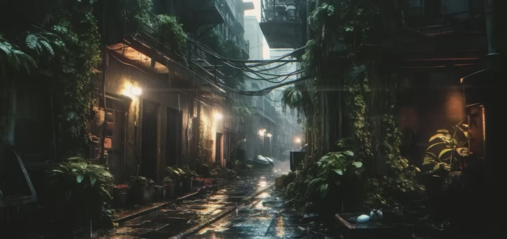
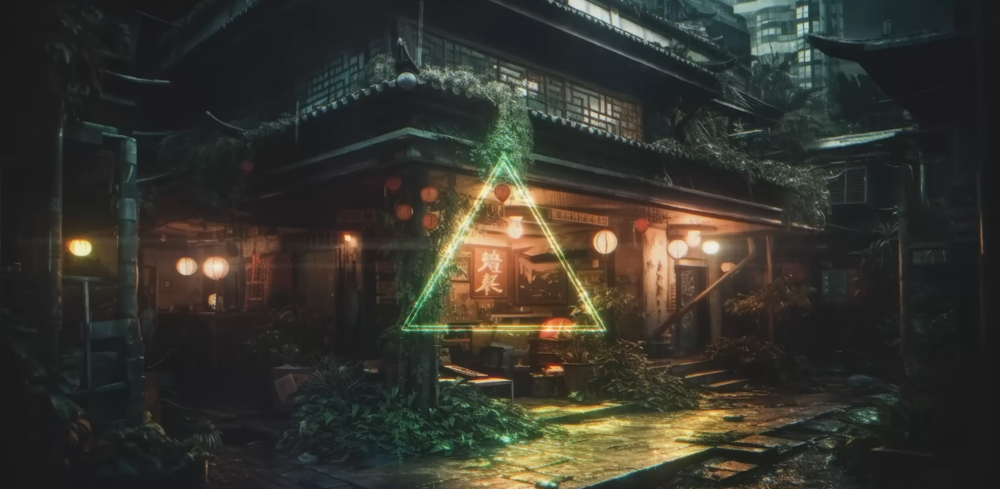
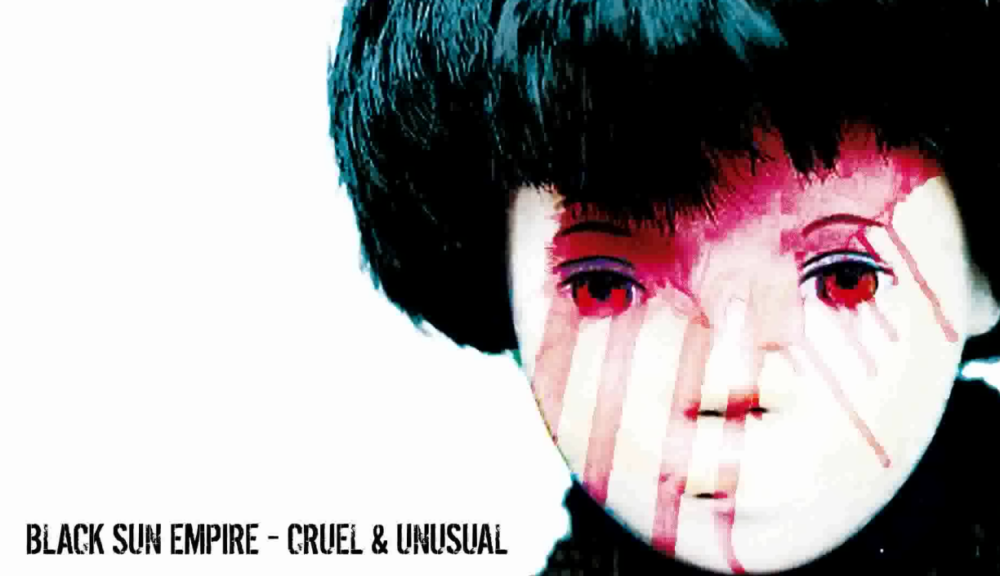
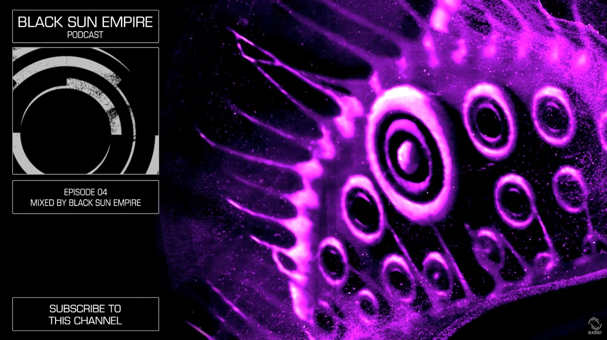
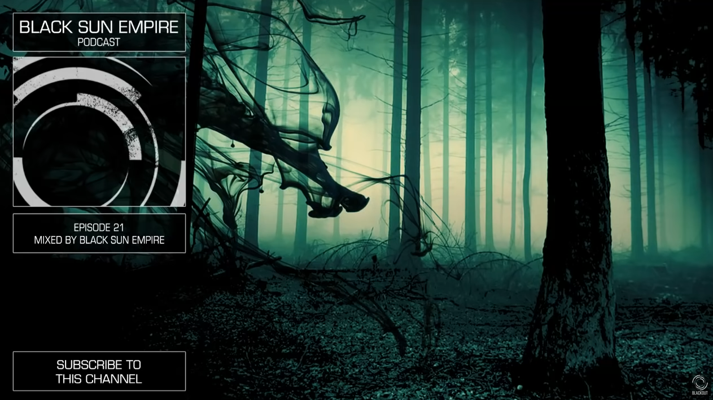

&nbsp;

# Sync_scanner
Программа, помогающая считывать буквенные данные с фотографий
   

# Навигация
 - [Установка проекта на ПК](#download_project)
 - [Настройка готового проекта](#setting_up_a_project)
 - [Полезные команды](#useful_commands)
 - [Основные технологии / фрейморки](#basic_technologies)
 - [Полезная информация](#useful_information)
 - [Основные зависимости](#main_dependencies)
 - [Музычка для разработки](#nekos_music)
   

 
## Установка проекта на ПК
1. Откройте консоль, вбив в поисковике ПК: <code>cmd</code>
2. Перейдите в директорию, куда хотите установить проект, пропишите следующую команду в консоль: <code>cd N:\Путь\до\папки\с\проектами</code>
3. Введите следующую команду: git clone https://github.com/[ник]/Sync_scanner.git
4. Откройте скачанный проект и можете приступать к разработке
   

 
## Настройка готового проекта
• Версия Python: 3.11

• После скачивания проекта к себе на компьютер не забудьте установить необходимые зависимости, прописав к консоли команду: 
<code>pip install -r requirements.txt</code>

[//]: # (• Создайте файл .env)
   

 
## Полезные команды
 - Сохранить список зависимость: `pip freeze > requirements.txt`
 - Не забывайте активировать venv при работе через консоль Ubuntu: `source venv/bin/activate`
 - Отобразить зависимости в консоль: `pip list`
   

 
## Основные технологии / фрейморки
`OpenCV`, `Pillow`, `Keras`, `BytelIO`
   

 
## Полезная информация
 - [Декораторы Python: пошаговое руководство](https://habr.com/ru/companies/otus/articles/727590/) (лёгкий способ, изучение подходов)  
 - [Распознавание текста с изображения на Python | EasyOCR vs Tesseract | Компьютерное зрение](https://www.youtube.com/watch?v=H_nXZSM4WiU)  
 - [Документация OpenCV](https://pypi.org/project/opencv-python/)  
 - [Python + OpenCV + Keras: делаем распознавалку текста за полчаса](https://habr.com/ru/articles/466565/) (актуальный способ с использованием данной библиотеки)  
 - [Документация Pillow](https://pypi.org/project/pillow/)  
   

 
## Основные зависимости
 - `opencv-python==4.9.0.80`
 - `pillow==10.2.0`
   

 
## Музычка для разработки [Neko's edition]
• Just chill  
|__ [SpaceWave: Ambient Cyberpunk Music](https://www.youtube.com/watch?v=FULCBFlX3Eo)  

  |   
|__ [SpaceWave: Zenctuary](https://www.youtube.com/watch?v=h4k1wIkmf7Q)  

  |   
|__ [SpaceWave: Vaporway](https://www.youtube.com/watch?v=70Wcz-k_PxY)  

• Dark Bass  
|__ [Black Sun Empire: Future Frame](https://www.youtube.com/watch?v=FZyqhW0uEmI&list=RD8zLJS8bvLEE&index=21) ♡   

  |   
|__ [Black Sun Empire: Podcast 04 HQ](https://www.youtube.com/watch?v=TwHS3c6zbwI) [0:00 - 8:15]  

  |   
|__ [Black Sun Empire: Podcast 21 HQ](https://www.youtube.com/watch?v=hgOzpEO47ZI&t=706s)  

   
